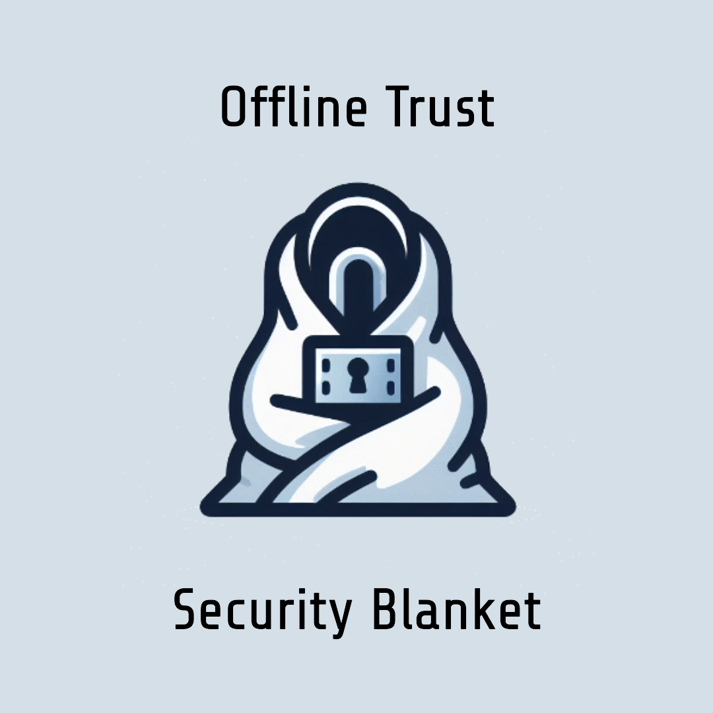

# Introducing The Security Blanket

Did you know the average person has over 200 online accounts? It’s a lot of work to keep track of all those accounts and passwords. Password managers have emerged to help lower the burden, but it’s still a lot to manage. What happens if you forget to add an account to the Password Manager? Or you forget the password to the Password Manager? Worst of all, everyone is facing the same dilemma, but facing it alone. You can’t just share this sensitive information, you have to be careful, and trusting 3rd-party services is risky. Most people resort to writing it down in a notebook. But what if a loved one needs access to your accounts in an emergency? So what do you do in a world where our digital lives continue to grow, becoming a bigger liability to manage, and it's tough to rely on anyone else?

The Security Blanket was designed to solve this problem. It is a paper-based, offline backup system that helps you organize and protect your most valuable digital assets, so you can sleep easy at night. It works by writing down all of your credentials and tools you need to access your accounts. That’s right, pen and paper. While a bit old-fashioned, there are many advantages:
* Information stays offline and thereby safe from potential data breaches. 
* Paper is an ironclad backup system that is resilient to technological glitches, power outages, or 3rd party services being down. 
* It is portable and compact, making it easy to store for safekeeping. 

The blanket itself represents the minimum amount of information needed to regain access to your accounts. So it is easy to store a copy of the blanket with a trusted family member in case you lose your copy in a disaster, or to help access your accounts on your behalf, when needed. Properly set up, the Security Blanket can come to your rescue in various scenarios, from forgetting a password to losing your phone or computer, or even when a natural disaster strikes.

The beauty of the Security Blanket is its simplicity. It’s not rocket science. It uses best practices to help keep your information safe, prevent costly mistakes, and provide a reliable backup plan in times of crisis.

So get your Security Blanket [today](https://shop.offlinetrust.com), or [learn more](../docs/getting-started.md)!
