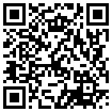

Hello!

Welcome to the Security Blanket — a paper-based card system for accessing digital accounts. Remember, this information is highly sensitive and strictly **FOR YOUR EYES ONLY**. 

> **DO NOT TAKE a photo, or copy the Security Blanket cards in any way. The best way to keep them secure is to keep everything offline and in a safe place.**

Thank you for being a trusted contact, it is a big responsibility to do the following:
1. Find a place to store the Security Blanket for safekeeping.
2. Familiarize yourself with the Security Blanket System.
3. Confirm with the owner that you've received the blanket, know how to use it, and have it safely stored away.
4. Reach Standby Mode

## 1. Store for Safekeeping
Find a safe, secure place to store this highly sensitive data. The owner trusts you and your judgment in selecting a location.

## 2. The Security Blanket System
There are three types of cards in the blanket. Start by locating the “device” cards and ensure you have access to the physical devices needed to access the accounts. Next, find the “tool” cards, and familiarize yourself with the software needed to access certain accounts. Most accounts require the use of a Password Manager and Multi Factor Authentication (MFA). Check out [security blanket support](./support/index.md) to learn more about any specific tool.

Finally, you have the “account” cards that detail all of the Top Level and Essential Accounts. Every card has a template that describes where to locate the information (Location \| Details) and how to access the information (Credentials). You can learn more about all the card sections and notation in the [overview](./card-overview.md) and [glossary](./glossary.md) pages.

Now is a great time to ask questions:
* Notify the owner if you don't have access to a device.
* For unfamiliar tools or software, check the [security blanket support page](./support/index.md) for help. If you are still having trouble, contact the owner for more details.
* If there's anything else you're not sure about, please contact the owner. Better to sort it out now, before it's an emergency.

## 3. Confirm Account Access

Run through a [test](./contact-test-template.md)(example template) using the Security Blanket to access the owner's accounts, verifying you can operate the blanket. The owner should have provided a customized version of the test for you.

Once completed, store the security blanket for safekeeping and confirm to the owner that you are in `Standby Mode`.

## 4. Standby Mode

Congratulations, you have reached `Standby Mode`! Stand by in case your services are required to access an account. From time to time, the owner may send you more cards to update your blanket, but no other action is needed on your part. 