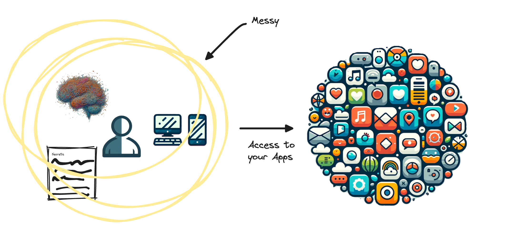
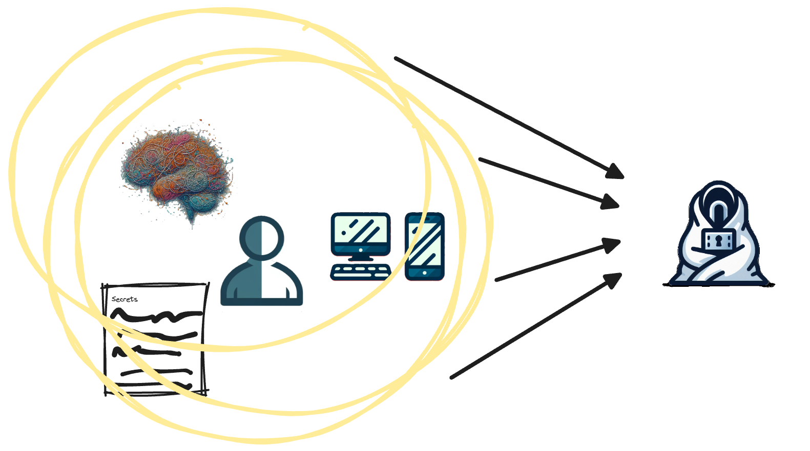
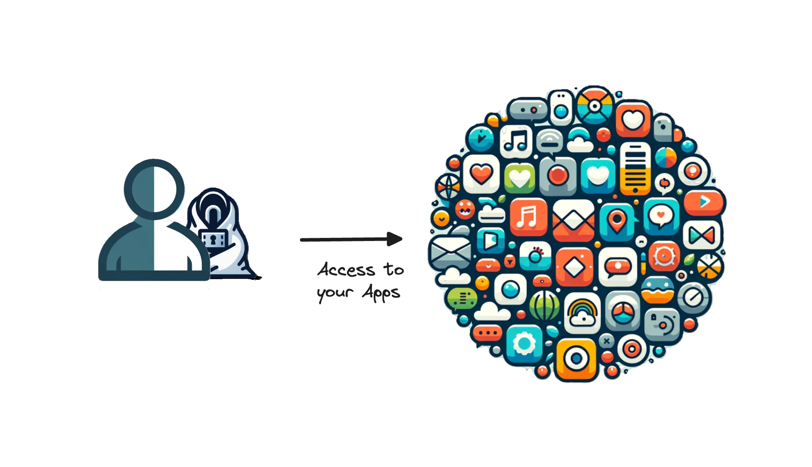
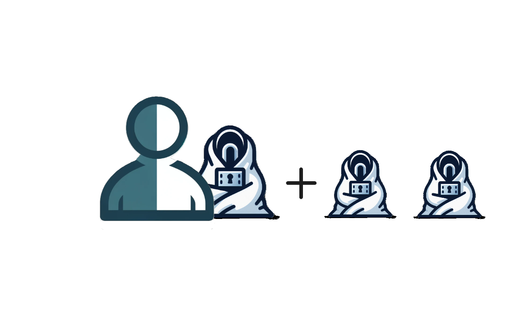
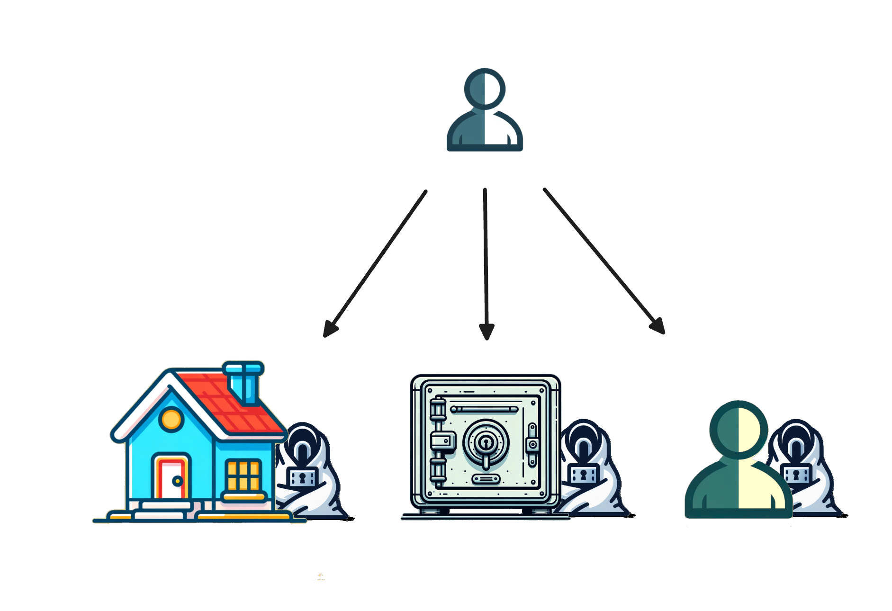

# How It Works

## 0. Review
Review the state of your digital life. WARNING: It's a bit messy.

## 1. Map
Organize and map your account access with the Security Blanket system.

## 2. Use
Organize and map your account access with the Security Blanket system.

## 3. Copy
Once verified, make some copies to have backups.

## 4. Distribute
Store your copies in different places for a robust backup plan.

## 5. Peace of Mind
Pat yourself on the back for backing up your digital world.