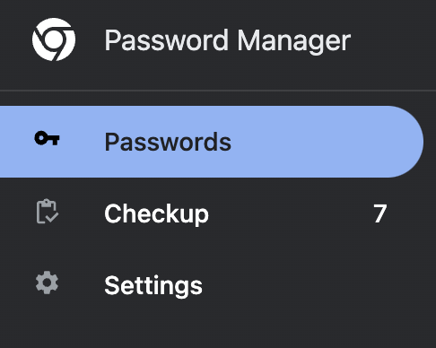

# Google Password Manager

The built-in Google Chrome Password Manager, now called Google Password Manager (GPW), is a great way to manage account credentials. You can find out the latest information at https://passwords.google/, but this guide will show you the basics.

## Location on the Computer

The GPW is built into Chrome, and you can access by going to [chrome://password-manager/passwords](https://passwords.google.com/app) in the URL bar of the browser OR clicking the `Chrome Menu > Settings > Autofill and passwords > Password Manager`

Note: you need to be logged into the Chrome browser with your Google account for this to work.

## Easiest way to use GPW
You don’t need to copy / paste passwords most of the time, because GPW will autofill them for you if the website matches an existing account.

1. Before typing into a username/password box, click into the form field and see if there’s a dropdown list of suggestions.
2. If so, click on it, and GPW will autofill the username and password automatically.

## How to find a password
1. Search for an account by typing into the search field after clicking the the top right corner Search Icon (https://passwords.google.com/app)

2. A list of all matching account names will show up.
3. Once you find the right account, the password will be hidden and look like

4. You can reveal the password by clicking the “eye” icon, which will require entering the device’s password to unlock.

## Additional Features

1. Use the [Checkup](chrome://password-manager/checkup) feature to detect any compromised passwords. This is great for good password hygiene!

